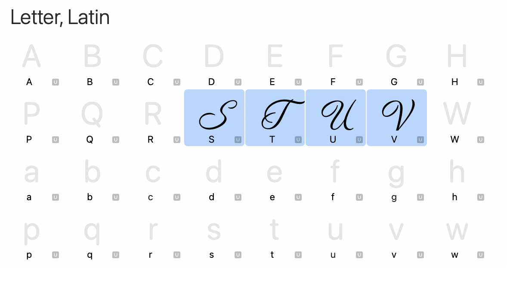
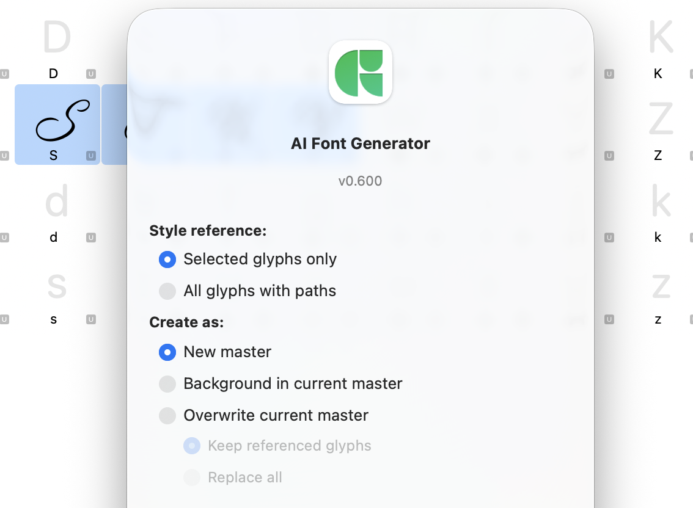
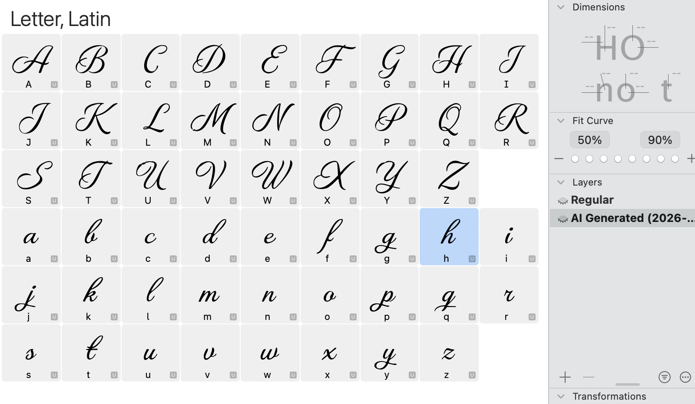
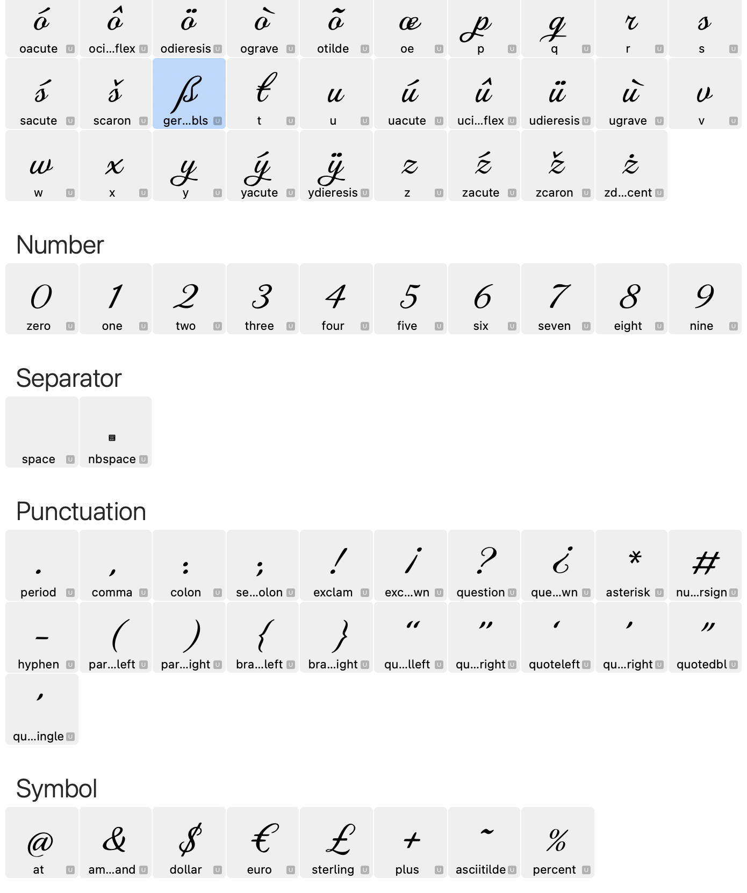
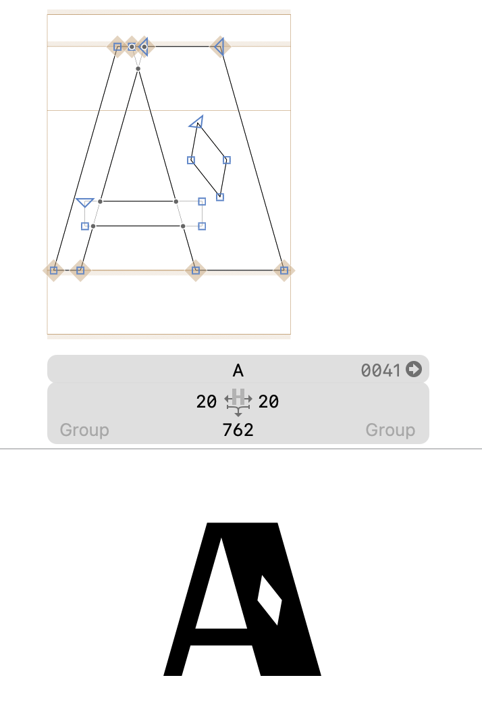
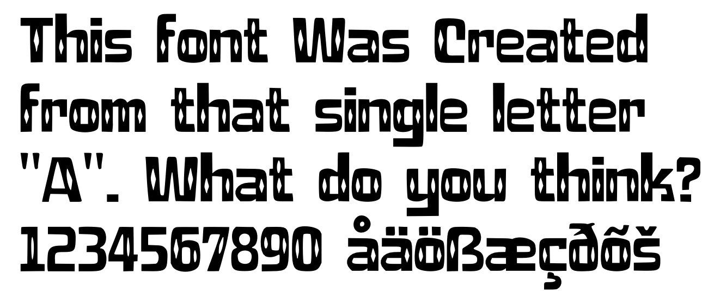

# AI Font Generator

Version 0.620

A [Glyphs 3](https://glyphsapp.com) plugin that generates a complete font from a few sample glyphs using AI.

## Installation

1. Download `AIFontGenerator.glyphsPlugin.zip`
2. Unzip and double-click `AIFontGenerator.glyphsPlugin`
3. Restart Glyphs

The plugin will appear under *Filter > AI Generate Full Font*.

## Usage

The following examples use the included sample files in the [examples/](examples/) folder.

### Example 1: DemographicScript01.glyphs

**1. Select the glyphs to use as style reference**

**2. Go to *Filter > AI Generate Full Font* and configure your options**

**3. Click Generate and wait a few minutes — the plugin creates a complete font**

**4. The result — a full font generated from just a few reference letters**

**5. Including accented characters, numerals, punctuation, and symbols**

### Example 2: DiamondSans01.glyphs

**Before: a single hand-drawn letter "A"**

**After: a complete font generated from that one letter**

## What is sent to the server

- A bitmap image of the selected glyphs
- Your Mac username and a Glyphs license identifier
- All data is processed and stored on aringtypeface.com

## Requirements

- **Glyphs 3**
- **macOS 10.14** or later
- **Internet connection**

## Important

- Save a copy of your work before running the plugin
- All glyph data is sent to and processed on the server
- Do not submit trademark/copyright protected or confidential work

## Updates

On each run, the plugin checks for newer versions. If an update is available, you'll be prompted to install it.

## License

Copyright 2026 Måns Grebäck. All rights reserved.

This plugin is provided as-is for use with Glyphs.app. Redistribution, modification, or reverse engineering is not permitted without prior written consent.
